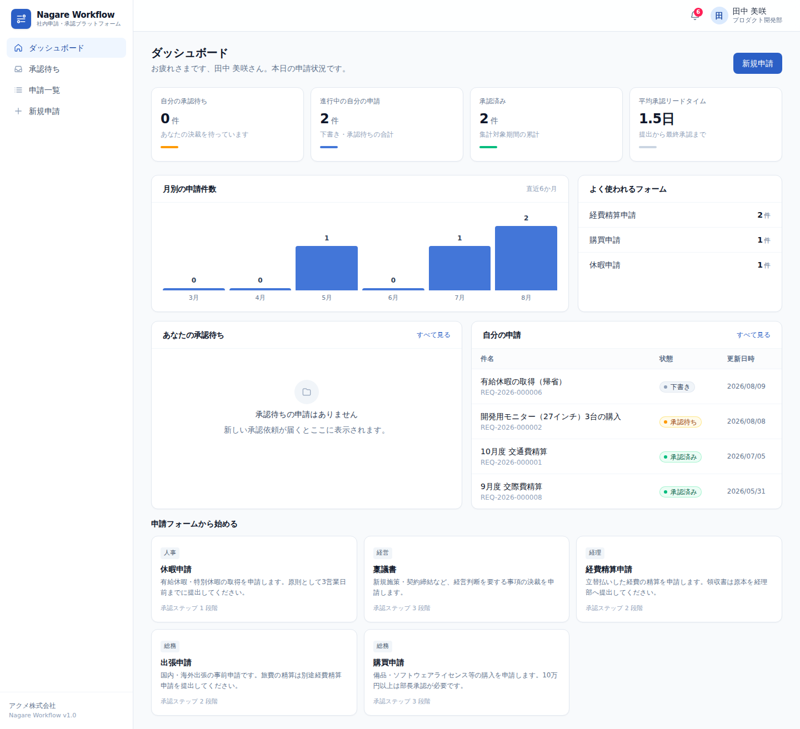
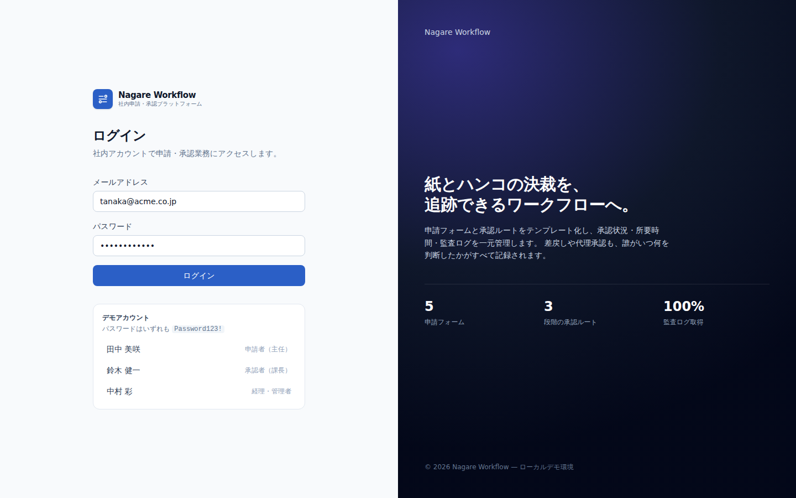
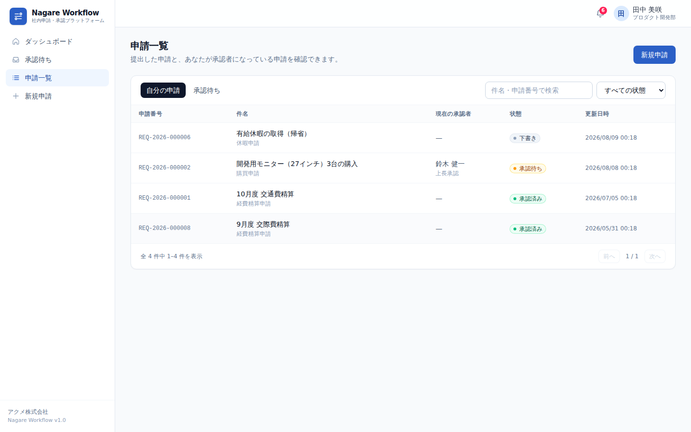
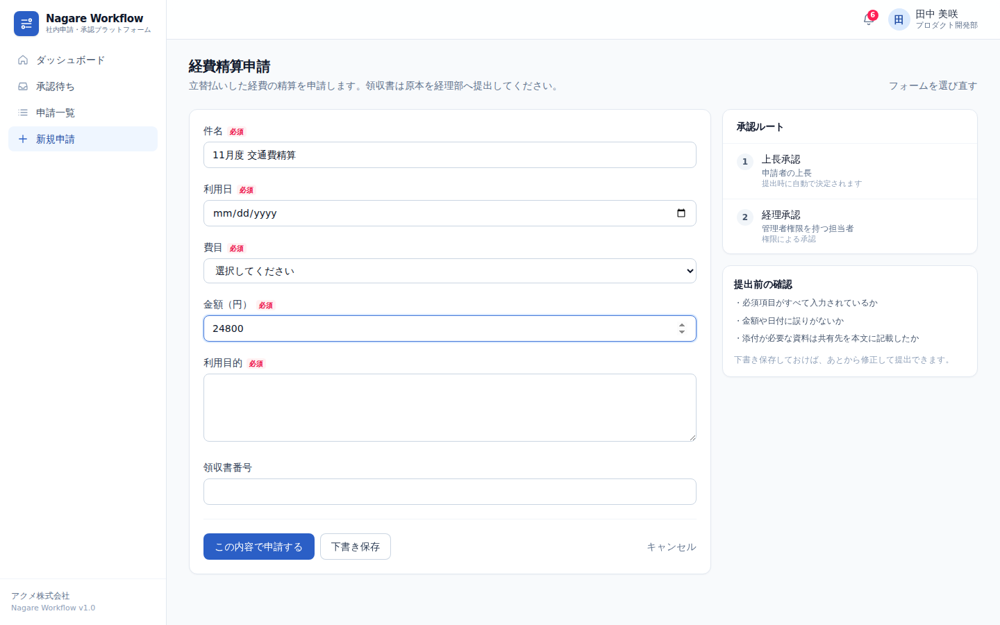
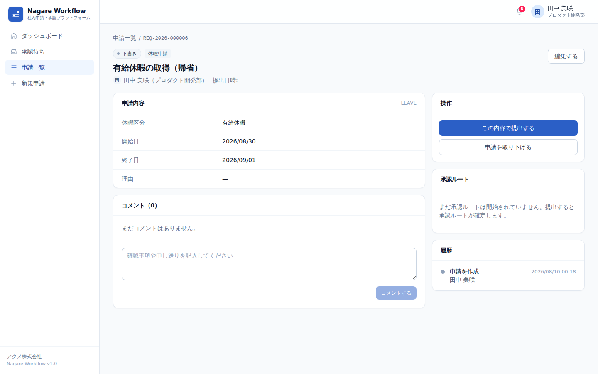
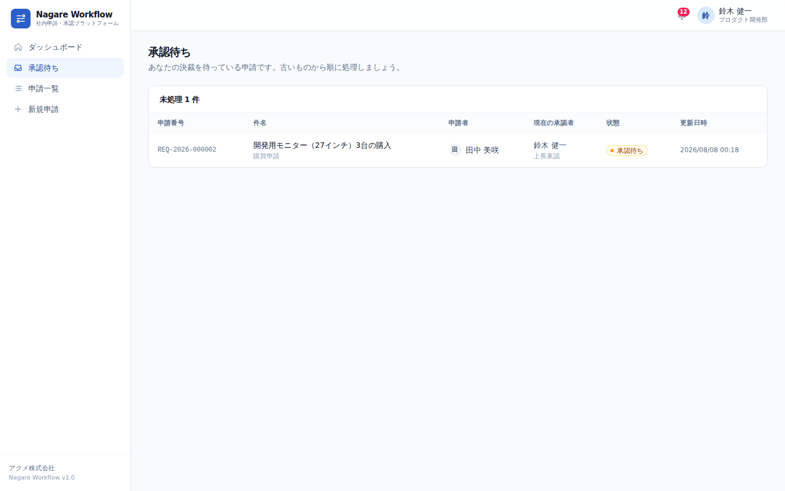
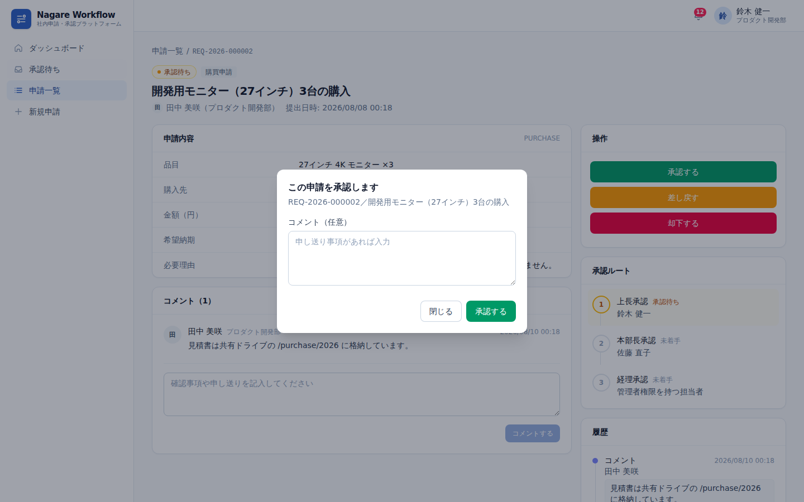
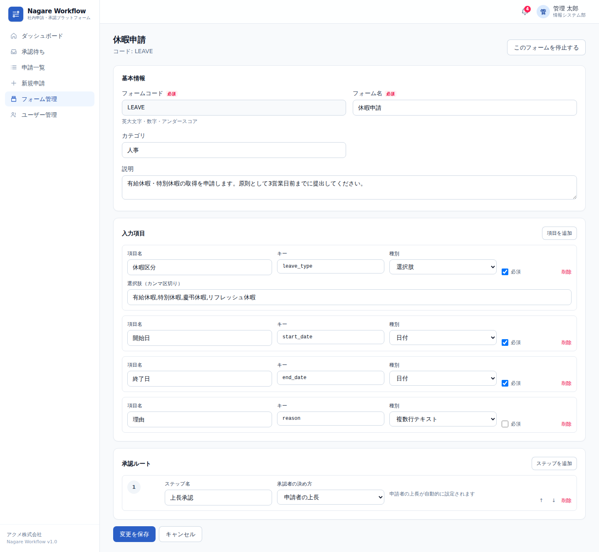
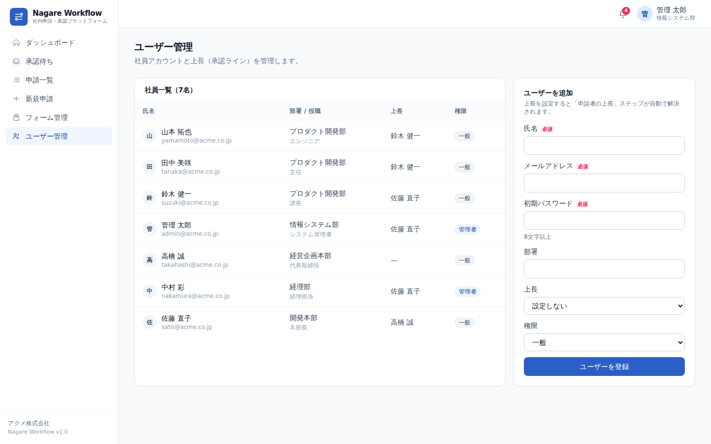

# Nagare Workflow — 社内申請・承認ワークフロー SaaS

稟議・経費精算・休暇申請といった社内申請を、**申請フォーム定義 → 多段階承認ルート → 監査ログ** まで一気通貫で扱うワークフロー SaaS のローカル実装です。マルチテナント、権限分離、差戻し・却下・取り下げ、通知、ダッシュボード集計を備えています。

- **バックエンド**: Python 3.11 / FastAPI / SQLAlchemy 2.0 / SQLite
- **フロントエンド**: Next.js 15 (App Router) / React 19 / TypeScript / Tailwind CSS v4
- **テスト**: pytest（97件）・Vitest（44件）・Playwright E2E（24件）＝ **165件**



---

## クイックスタート

```bash
make setup          # 依存関係のインストール + デモデータ投入
make dev-backend    # 別ターミナル: API      → http://localhost:8000/docs
make dev-frontend   # 別ターミナル: 画面     → http://localhost:3000
```

`make` を使わない場合:

```bash
# バックエンド
cd backend
uv venv .venv && uv pip install -e ".[dev]"      # または python3 -m venv .venv && .venv/bin/pip install -e ".[dev]"
.venv/bin/python -m app.seed --reset
.venv/bin/python -m uvicorn app.main:app --reload --port 8000

# フロントエンド（別ターミナル）
cd frontend
npm install
npm run dev
```

### デモアカウント

パスワードはいずれも `Password123!` です。

| ログイン ID | 氏名 | 役割 | 見どころ |
|---|---|---|---|
| `tanaka@acme.co.jp` | 田中 美咲（主任） | 申請者 | 申請の作成・下書き・再提出 |
| `suzuki@acme.co.jp` | 鈴木 健一（課長） | 一次承認者 | 承認 / 差戻し / 却下 |
| `sato@acme.co.jp` | 佐藤 直子（本部長） | 二次承認者 | 稟議の多段階承認 |
| `nakamura@acme.co.jp` | 中村 彩（経理） | 管理者 | 権限ベースの承認ステップ |
| `admin@acme.co.jp` | 管理 太郎 | 管理者 | フォーム管理・ユーザー管理・全件参照 |

---

## 機能

### 申請者
- カテゴリ別の申請フォームから申請を作成（下書き保存 / そのまま提出）
- フォーム定義に沿った動的入力フォームとクライアント・サーバー双方でのバリデーション
- 差戻しコメントを見ながら修正して再提出（再提出回数を記録）
- 申請の取り下げ、コメントでのやり取り

### 承認者
- 「承認待ち」インボックスで自分の決裁待ちだけを一覧
- 承認 / 差戻し / 却下（差戻し・却下は理由必須）
- 承認ルートの現在地と過去の判断コメントを可視化
- 通知ベル（未読件数・30秒ポーリング・一括既読）

### 管理者
- 申請フォームのノーコード定義（入力項目・種別・必須・選択肢）
- 承認ルートの設計（**上長 / 個人指名 / 権限**の 3 方式、並び替え可能）
- フォームの停止・再開、組織全体の申請の横断参照
- ユーザー登録と上長（承認ライン）の設定

---

## 画面

| | |
|---|---|
|  |  |
|  |  |
|  |  |
|  |  |

スクリーンショットは `make screenshots` で再生成できます（`frontend/screenshots/`）。

---

## アーキテクチャ

```
ブラウザ ──► Next.js (BFF)  ──►  FastAPI  ──►  SQLite
             ・httpOnly Cookie でJWTを保持   ・ワークフローエンジン
             ・Server Components でデータ取得 ・監査ログ / 通知
             ・/api/wf/* でプロキシ          ・テナント分離
```

**JWT はブラウザに渡しません。** ログインは Next.js の Route Handler が受け、トークンを `httpOnly` Cookie に格納します。以降のリクエストはサーバー側（Server Component）または BFF プロキシ `/api/wf/*` が Cookie からトークンを取り出して付与するため、XSS が起きてもトークンを盗み出せません。

### ディレクトリ構成

```
backend/
  app/
    models/        # SQLAlchemy モデル（組織・ユーザー・フォーム・申請・監査ログ・通知）
    services/
      workflow_service.py   # ★ 承認ステートマシン（唯一の状態遷移の入口）
      form_validation.py    # フォーム定義に対する入力検証
      request_query.py      # テナント安全な一覧クエリ
    api/routers/   # auth / users / templates / requests / notifications / analytics
    schemas/       # Pydantic の入出力スキーマ
    seed.py        # デモデータ
  tests/           # pytest（ドメイン 38 / API 51 / セキュリティ 8）
frontend/
  app/(app)/       # 認証後の画面（ダッシュボード・申請・承認・管理）
  app/api/         # ログイン / ログアウト / BFF プロキシ
  components/      # UI コンポーネント
  lib/             # API クライアント・型・整形・バリデーション
  tests/           # Vitest
  e2e/             # Playwright
```

### 承認ステートマシン

```
DRAFT ──submit──► PENDING ──approve(最終ステップ)──► APPROVED
  ▲                  │
  └───send_back──────┤──reject────────────────────► REJECTED
                     └──cancel────────────────────► CANCELLED
```

ルールはすべて `backend/app/services/workflow_service.py` に集約されています。

- 現在のステップの承認者だけが処理できる（順序の飛び越し不可）
- **自己承認の禁止**。ルート上の承認者が申請者本人の場合はそのステップを自動スキップ
- 承認者の解決方式は `user`（個人指名）/ `manager`（申請者の上長）/ `role`（権限保持者の誰でも）
- 差戻しは下書きに戻し、再提出時に承認ルートを作り直す（`round_no` を加算）
- すべての状態遷移を `audit_logs` に追記のみで記録し、関係者へ通知を発行
- 他テナントのデータには一切アクセスできない（全クエリが `organization_id` で絞り込み）

### 設計判断の記録（ADR）

主要な設計判断とその背景は `docs/adr/` に残しています。

| # | 決定 |
|---|---|
| [0001](docs/adr/0001-synchronous-backend-and-no-job-queue.md) | バックエンドを同期実装とし、ジョブキューを採用しない |

### セキュリティ上の設計

| 項目 | 実装 |
|---|---|
| パスワード | PBKDF2-HMAC-SHA256 / 260,000 反復・ソルト付き（標準ライブラリのみ） |
| セッション | HS256 JWT を `httpOnly` + `SameSite=Lax` Cookie に格納 |
| ログイン | 存在しないアカウントでも KDF を実行し、応答時間で存在を推測させない |
| 認可 | ルーター（テナント・ロール）＋サービス層（状態遷移）の二重チェック |
| テナント分離 | 全クエリを `organization_id` で絞り込み、越境アクセスは 404 / 403 |
| 監査 | `audit_logs` は追記専用。誰が・いつ・どの状態からどの状態へ遷移させたかを保持 |

---

## テスト

```bash
make test          # pytest + vitest
make test-backend  # 97 件
make test-frontend # 44 件
make e2e           # 24 件（バックエンド・フロントエンドを自動起動）
make lint          # ruff + tsc --noEmit
```

TDD で開発しています。振る舞いを先にテストで記述し、実装を通してから次の層へ進みました。

- `backend/tests/test_workflow_engine.py` — 承認ステートマシンの仕様（38件）
- `backend/tests/test_api.py` — HTTP 契約。フロントエンドが依存する仕様書も兼ねる（51件）
- `backend/tests/test_security.py` — ハッシュ・トークン（8件）
- `frontend/tests/` — 表示整形・入力検証・コンポーネント（44件）
- `frontend/e2e/` — ログイン、申請、多段階承認、差戻し・再提出、却下、通知、権限、管理機能（24件）

E2E は専用データベース `backend/workflow-e2e.db` を毎回作り直してから実行します。

> **注**: 実行環境に Playwright のブラウザが同梱されている場合は `CHROMIUM_PATH=/path/to/chromium npm run e2e` のように指定できます。通常は `npx playwright install chromium` で取得してください。

---

## API

OpenAPI ドキュメントは起動後 http://localhost:8000/docs で確認できます。

| メソッド | パス | 概要 |
|---|---|---|
| `POST` | `/api/v1/auth/login` | ログイン（アクセストークン発行） |
| `GET` | `/api/v1/auth/me` | ログイン中のユーザー |
| `GET` | `/api/v1/requests` | 申請一覧（`scope=mine\|inbox\|all`・状態・検索・ページング） |
| `POST` | `/api/v1/requests` | 申請の作成（`submit=true` で即提出） |
| `GET` | `/api/v1/requests/{id}` | 申請詳細（承認ルート・履歴・コメント・操作権限） |
| `PATCH` | `/api/v1/requests/{id}` | 下書きの更新 |
| `POST` | `/api/v1/requests/{id}/submit` | 提出 |
| `POST` | `/api/v1/requests/{id}/approve` | 承認 |
| `POST` | `/api/v1/requests/{id}/reject` | 却下（理由必須） |
| `POST` | `/api/v1/requests/{id}/send-back` | 差戻し（理由必須） |
| `POST` | `/api/v1/requests/{id}/cancel` | 取り下げ |
| `POST` | `/api/v1/requests/{id}/comments` | コメント投稿 |
| `GET/POST` | `/api/v1/templates` | 申請フォームの参照・作成（作成は管理者） |
| `PATCH` | `/api/v1/templates/{id}` | フォーム更新・停止 |
| `GET/POST` | `/api/v1/users` | 社員一覧・登録（登録は管理者） |
| `GET` | `/api/v1/notifications` | 通知一覧（未読件数付き） |
| `GET` | `/api/v1/analytics/summary` | ダッシュボード集計 |

エラーは常に `{"message": "...", "errors": {"フィールド名": "..."}}` の形で返ります。

---

## 設定

環境変数は `WF_` プレフィックス（バックエンド）で上書きします。

| 変数 | 既定値 | 説明 |
|---|---|---|
| `WF_DATABASE_URL` | `sqlite:///./workflow.db` | データベース接続先 |
| `WF_SECRET_KEY` | ローカル用の固定値 | JWT 署名鍵。**本番では必ず変更** |
| `WF_ACCESS_TOKEN_EXPIRE_MINUTES` | `720` | トークン有効期間（分） |
| `WF_CORS_ORIGINS` | `["http://localhost:3000"]` | CORS 許可オリジン |
| `API_BASE_URL` | `http://127.0.0.1:8000` | フロントエンドから見た API の場所 |

---

## 本実装の割り切り

ローカルで動くデモとして完結させるため、以下は範囲外としています。実運用に載せる場合の主な追加項目です。

- DB マイグレーション（Alembic）と PostgreSQL への切り替え
- ファイル添付、メール／チャット通知、SSO（SAML・OIDC）
- 条件分岐ルート（金額による承認者の切り替え）、代理承認、一括承認
- 監査ログの外部保管、レート制限、リフレッシュトークン
